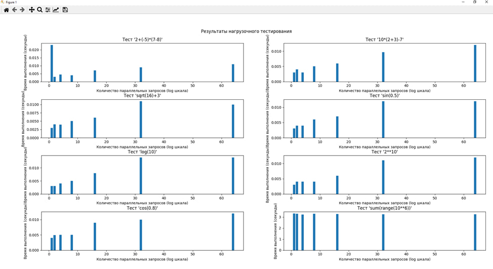

# Лабораторная работа №7



### Тема: Нагрузочное тестирование, стрессовое тестирование

### Установка

```bash
git clone https://github.com/Avdushin/TIS7
cd TIS7
pip install matplotlib
```

### Файлы

```bash
main.py - Компилятор (парсер) простых арифметических выражений
test.py - Нагрузочное тестироване
